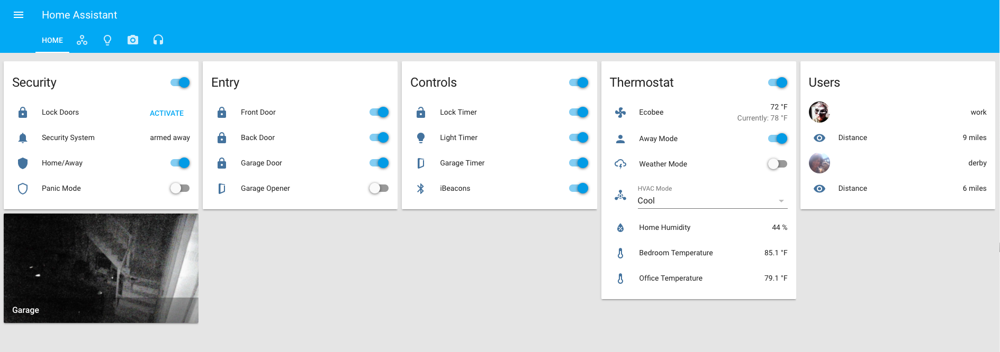

# Home Assistant
Example Config

https://home-assistant.io

Host:<ul>
<li>Intel NUC</li>
<li>Aeotec USB Z-Stick Gen 5</li>
</ul>

Devices:
<ul>
<li>Schlage BE469CEN</li>
<li>GE 12722</li>
<li>Aeotec Window/Door Sensor 6</li>
<li>Ecobee 3</li>
<li>MyQ Garage Door Controller</li>
<li>Ubiquity UVC-Micro</li>
</ul>

Notes:<ul>
<li>Ecobee currently using this <a href=https://github.com/home-assistant/home-assistant/pull/2092>Pull Request</a></li>
<li>MyQ with PI in garage using bluetooth device_tracker for car and MQTT event_stream... slow to detect but works</li>
<li>My input sliders don't work correctly and using some of the templating options breaks stuff for now</li>
</ul>

# Interface

