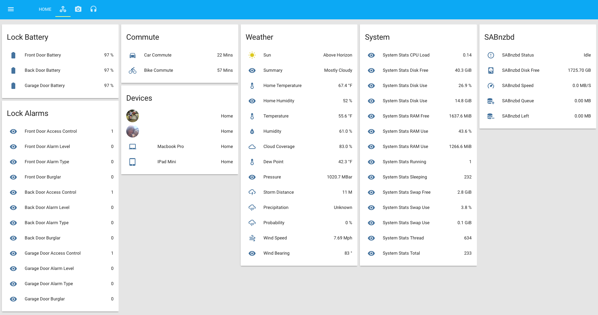
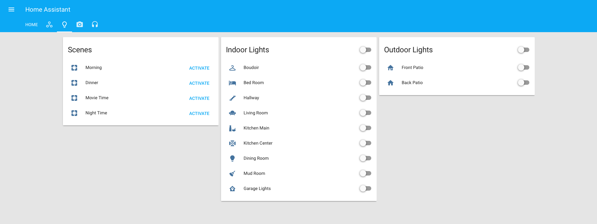

# Home Assistant

https://home-assistant.io

Host:<ul>
<li>Intel NUC</li>
<li>Aeotec USB Z-Stick Gen 5</li>
</ul>

Devices:
<ul>
<li>Schlage BE469CEN Locks</li>
<li>GE 12722 / Linear WD500Z-1 Switches/Dimmers</li>
<li>Aeotec Window/Door Sensor 6</li>
<li>Aeotec Siren</li>
<li>Ecobee 3</li>
<li>MyQ Garage Door Controller</li>
<li>Ubiquity UVC-Micro</li>
<li>Minew i3 Long Range iBeacons</li>
</ul>

Notes:<ul>
<li>Ecobee currently using this: <a href=https://github.com/home-assistant/home-assistant/pull/2092>Pull Request</a></li>
<li>MyQ currently using this: <a href=https://github.com/home-assistant/home-assistant/pull/1961>Pull Request</a></li>
<li>Using Owntracks, Mosquitto server & <a href=http://www.amazon.com/Long-Range-Bluetooth-Programmable-Management-Platform/dp/B01CERV4KG>iBeacons</a> for presence detection</li>
<li>Beta testing Homeassistant iOS App with custom notifcation component by @robbiet480</li>
</ul>

# Interface

